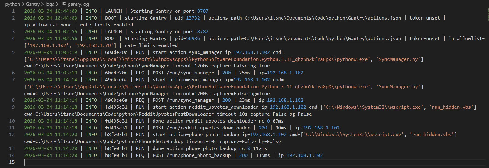

<p align="center">
  
</p>

<h1 align="center">GANTRY</h1>

<p align="center">
  <strong>The Script-to-API Bridge</strong><br>
  Securely expose local scripts, binaries, and automation as REST endpoints with zero code.
</p>

<p align="center">
  
  
  
</p>

---

A highly flexible, configuration-driven local API bridging automated tasks, scripts, and webhooks securely across your network. 

Stop worrying about building new web servers every time you write a script. Just map your local `.py`, `.bat`, `.vbs`, or `.sh` files in a JSON config, and **GANTRY** instantly exposes them as secure REST API endpoints.

## 🏗️ Why Gantry?

Developing a custom web server every time you write a local script is a repetitive, time-consuming chore. **Gantry** removes that friction by acting as a universal "plug-and-play" bridge.

*   **The Problem:** You have a local Python script, `.vbs` file, or `.sh` script that you need to trigger from a Discord Bot, an n8n workflow, or a mobile shortcut (like iOS Shortcuts).
*   **The Gantry Way:** You add one line to your `actions.json`. Gantry instantly creates a secure REST endpoint for that script, handles the security, manages the background execution, and rotates the logs for you.

### 🎯 Use Cases
*   **Home Lab Automation:** Trigger server backups, photo backups, or sync managers via webhooks.
*   **Discord Integration:** Use tools like [DashCord](https://github.com/nextgearslab/DashCord) to trigger local scripts securely via Discord buttons.
*   **Cross-Platform Workflows:** Run Windows-specific VBScript/Binaries from a Linux-based automation platform (and vice versa).
*   **Heavy Processing:** Offload heavy tasks (like AI Video Orchestration or TTS Generation) to a local machine from low-power cloud triggers.

---

## 🖥️ Live Monitoring & Orchestration

Gantry provides a high-visibility logging engine that tracks every request, background task, and script exit code in real-time.

<p align="center">
  
</p>

---

## 🌟 Features

* **Cross-Platform Compatibility:** Runs flawlessly on both Windows Native and Linux/Docker environments.
* **Fire-and-Forget Background Tasks:** Trigger heavy orchestration scripts silently in the background without holding up your webhook responses.
* **Dynamic Argument Injection:** Pass payload variables directly from your POST request safely into your command line arguments using `{{placeholders}}`.
* **In-Memory Rate Limiting:** Prevent endpoint abuse by defining max requests and time windows on a per-action basis.
* **Base64 Auto-Decoding:** Safely pass complex or multiline strings via webhooks; Gantry will decode them on the fly before passing them to your scripts.
* **Stealth Mode:** Hide your server's internal file paths, commands, and raw text output. Stealth mode returns a minimal success boolean and Base64-encoded output.
* **Self-Healing Socket Management:** The app automatically finds and kills zombie processes holding onto its required port before starting.
* **Built-in Security:** Restrict execution using `X-Token` headers and customizable IP Allow-lists. Includes a rate-limit bypass for trusted IPs.
* **Smart Log Rotation:** Neatly categorizes logs into a discrete `/logs` subfolder, ensuring your directory stays clean while managing file rotation automatically.

---

## 📋 Prerequisites
* **Python 3.9+**: Required for async lifespan management and advanced type hinting.
* **Permissions**: Ensure the user account running `gantry.py` has execution permissions for the scripts defined in your configuration.
* **Config File**: Gantry will fail to boot if your actions configuration file (default: `actions.json`) does not exist or contains invalid JSON formatting.

---

## 🛠️ Quick Start 

### 1. Installation
Clone the repository and install the requirements.
```bash
git clone https://github.com/nextgearslab/GANTRY.git
cd GANTRY
pip install -r requirements.txt
```

### 2. Setup Configuration
Copy the example configuration files and add your specifics.
```bash
cp .env.example .env
cp actions.json.example actions.json
```

### 3. Run the Server
Simply execute the script. It will self-heal its assigned port and initialize.
```bash
python gantry.py
```

*(If running via Docker/Uvicorn directly, you can also launch via: `uvicorn gantry:app --host 0.0.0.0 --port <YOUR_PORT>`)*

---

## 🛡️ Windows Background Service & Watchdog
For Windows users, this repo includes a built-in background launcher and health-checker.

Instead of keeping a terminal window open forever, simply double-click **`run.bat`**. 
1. It silently checks if Gantry is responding on your **configured port** (defined in `.env`).
2. If it's down, it launches `gantry.py` completely hidden in the background.
3. If it crashes, clicking `run.bat` again will instantly revive it.

Watchdog logs are automatically generated in `logs/gantry_watchdog.log`.

---

## 🐳 Running with Docker (Recommended for Linux/Servers)
Gantry includes a fully configured Docker environment.

1. Ensure your `.env` and `actions.json` are configured.
2. Build and start the container:
```bash
chmod +x start.sh
./start.sh
```
*(To view live logs, simply run `./logs.sh`)*

---

## 🔧 Pro Configuration (`.env`)

GANTRY is highly customizable. You can fine-tune exactly how the API, your security restrictions, and your logging behave by modifying your `.env` file. 

#### 🤖 General Server Settings
- `GANTRY_SERVER_NAME`: The custom Server header value returned in all API responses (Default: `Gantry`).
- `GANTRY_PORT`: The local port the API binds to (Default: `8787`).
- `GANTRY_ACTIONS_PATH`: The exact file path to your actions routing configuration (Default: `actions.json`).

#### 🔒 Security & Authorization
- `GANTRY_TOKEN`: **(Highly Recommended)** A secret string sent as the `X-Token` HTTP header to secure your endpoints from unauthorized network requests.
- `GANTRY_IP_ALLOWLIST`: A comma-separated list of IP addresses allowed to hit the API. If set, any unlisted IP will receive a 403 Forbidden error.

#### ⏱️ Rate Limiting
- `GANTRY_RATE_LIMIT_ENABLED`: Master switch to turn the rate limiter on or off (Default: `true`).
- `GANTRY_RATE_LIMIT_BYPASS_IPS`: A comma-separated list of trusted IP addresses that will completely bypass any rate limits defined in your actions.

#### 📝 Logging Engine
* `GANTRY_LOG_LEVEL`: Log verbosity (`INFO`, `DEBUG`, `WARNING`, `ERROR`). 
  > 🛡️ **Iron Fortress Note:** Set to `INFO` to mask internal system errors with a generic message. Set to `DEBUG` to expose full Python stack traces in API responses. (Default: `INFO`).
- `GANTRY_LOG_FILE`: The relative or absolute path where log files will be saved (Default: `logs/gantry.log`).
- `GANTRY_LOG_MAX_BYTES`: The maximum size of a single log file before it rotates (Default: `2097152` / 2MB).
- `GANTRY_LOG_BACKUP_COUNT`: The number of rotated log files to keep in history before deleting the oldest (Default: `5`).

---

## ⚙️ Configuration File (`actions.json`)

All routing logic is driven by your actions configuration file (default: `actions.json`). You define "actions" which map a URL path to a local executable. 

### Action Properties
* `exe`: The executable to run (e.g., `python`, `bash`, `C:\\Windows\\System32\\wscript.exe`).
* `cwd`: The working directory the script should execute in.
* `args`: Array of command line arguments. Use `{{key}}` to dynamically inject payload parameters. 
  > 💡 **Pro-Tip on Arguments:** Always define `args` as a list of individual strings (e.g., `["--user", "{{name}}"]`). Do not combine them into a single string (e.g., `["--user {{name}}"]`), as this will cause OS shell-parsing errors.
* `timeout_seconds`: How long before the API forcefully kills the script.
* `capture_output`: Whether to read `stdout` and `stderr` (Set to `false` for silent/visual apps, or background Windows apps).
* `background`: If `true`, the API returns a success response instantly and detaches the process to run in the background.
* `stealth`: If `true`, hides the command structure and returns a minimal response with a Base64 encoded output.
* `decode_b64_params`: An array of payload parameter keys to automatically decode from Base64 before injecting them into `args`.
* `rate_limit`: An object containing `max_requests` and `window_seconds`.
* `require_token`: (Optional) Route-specific authentication.
  * **Omit** (Default): Uses the global `GANTRY_TOKEN` from your `.env`.
  * `false`: Disables token auth for this route (**Public Access**).
  * `"string"`: Requires a unique token for this specific route instead of the global one.
  
### 🐧 Real-World Example: Linux / Docker Server
This example shows how to set up Discord relays, manage network logs with rate limits, and utilize **Stealth Mode** with **Base64 decoding** to safely pass complex multiline data.
```json
{
  "version": 1,
  "actions": {
    "discord_relay": {
      "exe": "python",
      "cwd": "/app",
      "args": ["scripts/discord_sender.py", "--type", "{{type}}", "--msg", "{{msg}}"],
      "timeout_seconds": 10,
      "capture_output": true,
      "rate_limit": {
        "max_requests": 3,
        "window_seconds": 30
      }
    },
    "x_relay_01": {
      "exe": "python",
      "cwd": "/app", 
      "args":["scripts/discord_sender.py", "--type", "{{type}}", "--msg", "{{msg}}"],
      "decode_b64_params": ["msg", "type"],
      "stealth": true,
      "timeout_seconds": 10,
      "capture_output": true
    },
    "add_network_log": {
      "exe": "python",
      "cwd": "/app",
      "args":[
        "scripts/network_logger.py", "--action", "add",
        "--event_type", "{{type}}", "--node", "{{node}}", "--ip", "{{ip}}"
      ],
      "capture_output": true,
      "rate_limit": {
        "max_requests": 5,
        "window_seconds": 30
      }
    }
  }
}
```

### 🪟 Real-World Example: Windows Heavy Automation
This example perfectly demonstrates using `wscript.exe` and `.vbs` to trigger hidden visual tasks, as well as using `pythonw.exe` to trigger completely detached, fire-and-forget background tasks (like AI Orchestration) without popping up a terminal window.
```json
{
  "version": 1,
  "actions": {
    "phone_photo_backup": {
      "exe": "C:\\Windows\\System32\\wscript.exe",
      "cwd": "C:\\Code\\python\\PhonePhotoBackup",
      "args": ["run_hidden.vbs"],
      "timeout_seconds": 10,
      "capture_output": false
    },
    "ai-video-orchestrator": {
      "exe": "C:\\Code\\python\\AIVideoOrchestrator\\venv\\Scripts\\python.exe",
      "cwd": "C:\\Code\\python\\AIVideoOrchestrator",
      "args":[
        "queue_plan.py",
        "--b64", "{{plan_b64}}",
        "--source", "{{source}}"
      ],
      "timeout_seconds": 30,
      "capture_output": true
    },
    "tts-manager": {
      "exe": "C:\\Users\\Admin\\AppData\\Local\\Microsoft\\WindowsApps\\pythonw.exe",
      "cwd": "C:\\Code\\python\\AITTSOrchestrator",
      "args":[
        "tts_manager.py",
        "--raw", "{{text_raw}}",
        "--b64", "{{attachment_b64}}"
      ],
      "timeout_seconds": 30,
      "capture_output": true,
      "background": true
    }
  }
}
```

### 💡 Advanced Trick: The "detected" IP Variable
If you pass `"ip": "detected"` in your JSON body parameters, the API will intercept it and replace it with the requester's actual IP address. You can then map `"{{ip}}"` into your `args` to easily pass caller IPs to your internal scripts.

---

## 🌐 Core Endpoints

Gantry provides utility endpoints to easily verify your configuration and connectivity.

| Method | Endpoint | Description |
| :--- | :--- | :--- |
| `GET` | `/health` | Simple uptime check. Returns `{"ok": true}`. |
| `GET` | `/actions` | Lists all active action names currently loaded from your actions configuration. |
| `POST` | `/run/{name}` | The main execution endpoint for a specific action. |

---

## 📦 Request & Response Payloads

Whenever a script is triggered, make a `POST` request to `http://<YOUR_IP>:<GANTRY_PORT>/run/<action_name>`.

### 🔑 Authentication
If `GANTRY_TOKEN` is set in your `.env`, you must include it as an HTTP header:
`X-Token: your_secret_token_here`

### 📥 Request (JSON Body)
Provide dynamic arguments inside the `params` object:
```json
{
  "params": {
    "name": "Admin",
    "ip": "detected"
  }
}
```

### 🧪 Testing with Dry Run
Before executing a script for real, you can pass `"dry_run": true` in your JSON body. Gantry will validate your `X-Token`, check IP permissions, and render all `{{placeholders}}` into the final command string without actually executing the script on your system.
```json
{
  "params": {
    "msg": "Server backup completed successfully!"
  },
  "dry_run": true
}
```

### 📤 Standard Response (JSON)
The API returns a detailed JSON summary of the execution:
```json
{
  "ok": true,
  "action": "linux_discord_relay",
  "returncode": 0,
  "stdout_tail": "Message sent to Discord.",
  "stderr_tail": "",
  "cmd":["python", "scripts/discord_sender.py", "--msg", "Server backup completed successfully!"],
  "request_id": "8a3b11cf"
}
```

### 📤 Background Response
If `background: true` is set in the action, it returns instantly without waiting for completion:
```json
{
  "ok": true,
  "action": "tts-manager",
  "background": true,
  "message": "Task started in background",
  "request_id": "b71a99df"
}
```

### 🥷 Stealth Response
If `stealth: true` is enabled, execution details (like `cmd` and raw text) are scrubbed. The standard output is returned as a raw Base64 string in the `data` key:
```json
{
  "ok": true,
  "data": "U3lzdGVtIGhlYWx0aCBvcHRpbWFsLiBDUFU6IDI0JQ=="
}
```

### 🛑 Rate Limit Exceeded (HTTP 429)
If a webhook triggers an endpoint too many times within your configured `window_seconds`:
```json
{
  "detail": "Too Many Requests. Rate limit exceeded."
}
```